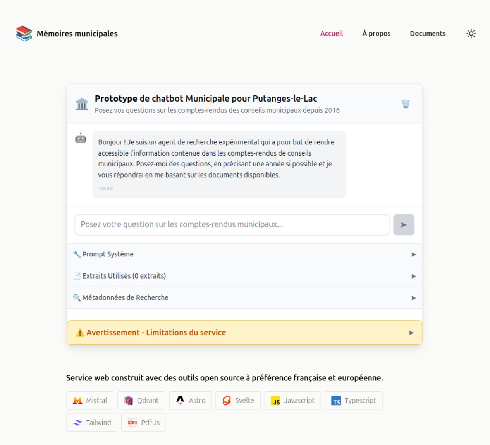

# Ask Municipal Memory: MVP for Transparent Municipal Council Search



## Project Overview

**Ask Municipal Memory** is a Minimum Viable Product (MVP) for a Retrieval-Augmented Generation (RAG) application. Its goal is to enable natural language search through the city council minutes of the municipality of Putanges-le-Lac. The project is designed to promote transparency and make public information more accessible to all citizens.

- **Mission:** Facilitate transparency and accessibility of municipal information by allowing anyone to query council minutes in plain language.
- **Open Source:** This project have been made with a lot of pedagogy and good practices. So far, we welcomes contributions and feedback. Feel free to open issues, submit pull requests, or suggest improvements!
- **French:** As we use ia assistant coding in french because we are french speakers for now on the projet, a lot of comment are in french. Sorry for non-french speakers. Feel free to propose translations.

## 🚀 Quick Start

### Prerequisites

Before running the project, you need to set up the following services:

1. **Hugging Face Account** - [Sign up for free](https://huggingface.co/join)
2. **Qdrant Cloud Account** - [Sign up for free](https://cloud.qdrant.io/)

### Environment Configuration

Create a `.env` file in the root directory with the following variables:

```bash
# Hugging Face API Key (required)
HUGGINGFACE_API_KEY=your_huggingface_api_key

# Qdrant Configuration (required)
QDRANT_URL=https://your-qdrant-instance.qdrant.io
QDRANT_API_KEY=your_qdrant_api_key
QDRANT_COLLECTION_NAME=municipal_council_minutes
```

### Local Development

```bash
npm install
npm run dev
```

### Production Build

```bash
npm run build
npm run preview
```

## 🏗️ Architecture & Data Flow

### System Overview

The application follows a modern RAG (Retrieval-Augmented Generation) architecture with **hybrid temporal search**:

```
[Question utilisateur]
    ↓
[Génération d'embedding]
    ↓
[Recherche vectorielle Qdrant]
    ↓
[Recherche hybride temporelle]
    ↓
[Construction du contexte]
    ↓
[Génération LLM Mistral]
    ↓
[Enrichissement des sources]
    ↓
[Réponse finale]
```

### Detailed Data Flow

1. **User Input** 📝

   - User types a question in the Svelte chat interface
   - Question is sent via POST to `/api/chat`

2. **Embedding Generation** 🔍

   - Question is converted to vector embedding using Hugging Face
   - Model: `sentence-transformers/all-MiniLM-L6-v2` (384 dimensions)

3. **Vector Search** 🎯

   - Embedding is used to search Qdrant vector database
   - Returns top 20 most relevant document chunks (increased for temporal filtering)
   - Includes metadata: filename, page number, relevance score, year

4. **Hybrid Temporal Search** ⏰

   - **Year extraction**: Automatic detection of year in user query
   - **Temporal filtering**: Selection of documents within ±2 years window
   - **Score weighting**: Combination of vector similarity and temporal relevance (30% temporal weight)

5. **Context Building** 📚

   - Top 10 most relevant chunks are assembled into context
   - Sources are properly attributed with file, page, year, and temporal relevance information

6. **LLM Generation** 🤖

   - Context + user question sent to Mistral-7B-Instruct-v0.2
   - Uses chat completion API for natural conversation
   - Generates contextual response with source citations

7. **Response Delivery** 📤
   - Structured JSON response with answer, enriched sources, and search metadata
   - Sources displayed in chat interface with relevance scores and temporal information

### Technical Stack

- **Frontend:** Astro + Svelte components
- **Backend:** Astro API Routes (server-side)
- **Vector Database:** Qdrant Cloud
- **AI Services:** Hugging Face Inference API
- **Temporal Search:** Custom hybrid search algorithm
- **Deployment:** Vercel (ready)

## 🔍 Hybrid Temporal Search

### Principle

The hybrid search combines vector similarity with temporal relevance to improve result quality. When a user asks about a specific year, the system:

1. **Extracts the year** from the user query automatically
2. **Filters documents** within a ±2 years tolerance window
3. **Weights scores** by combining vector similarity (70%) and temporal relevance (30%)

### Configuration

```javascript
const HYBRID_SEARCH_CONFIG = {
  TEMPORAL_WEIGHT: 0.3, // Weight of temporal factor
  YEAR_TOLERANCE: 2, // Tolerance in years (±2)
  ENABLE_FILTERING: true, // Enable temporal filtering
  ENABLE_WEIGHTING: true, // Enable temporal weighting
};
```

### Year Detection Examples

- "Projets 2025" → year: 2025
- "Budget de l'année 2024" → year: 2024
- "Décisions du conseil en 2023" → year: 2023
- "Projets futurs" → no year detected

## 📡 API Reference

### POST /api/chat

The core API endpoint that handles RAG queries with hybrid temporal search.

#### Request

```javascript
const response = await fetch('/api/chat', {
  method: 'POST',
  headers: {
    'Content-Type': 'application/json',
  },
  body: JSON.stringify({
    message: 'Quels sont les projets pour 2025?',
  }),
});
```

#### Success Response (200)

```json
{
  "answer": "Réponse générée par l'IA basée sur les documents municipaux...",
  "sources": [
    {
      "filename": "compte-rendu-seance-2025-01-15.pdf",
      "page": 8,
      "year": 2025,
      "score": 0.85,
      "originalScore": 0.78,
      "temporalScore": 0.95,
      "url": "/datas/2025/compte-rendu-seance-2025-01-15.pdf",
      "urlWithPage": "/datas/2025/compte-rendu-seance-2025-01-15.pdf#page=8"
    }
  ],
  "chunksFound": 5,
  "searchMetadata": {
    "queryYear": 2025,
    "temporalFilterApplied": true,
    "temporalWeightingApplied": true,
    "originalCount": 20,
    "filteredCount": 8
  },
  "systemPrompt": "...",
  "contextText": "...",
  "userPrompt": "..."
}
```

#### Error Responses

**400 - Invalid message**

```json
{
  "error": "Message manquant ou invalide"
}
```

**405 - Method not allowed**

```json
{
  "error": "Méthode GET non supportée. Utilisez POST."
}
```

**500 - Server error**

```json
{
  "error": "Erreur lors du traitement de votre demande",
  "details": "Technical error details"
}
```

### POST /api/QdrantUploader

The document indexing API that processes and stores municipal documents in the Qdrant vector database.

#### Overview

This endpoint implements a complete document processing pipeline:

1. **Input Validation** - Validates document structure and content
2. **Collection Management** - Creates or verifies Qdrant collection
3. **Intelligent Chunking** - Splits documents into optimal chunks (~1000 characters)
4. **Embedding Generation** - Creates vector embeddings for each chunk
5. **Metadata Enrichment** - Adds comprehensive metadata for traceability
6. **Vector Storage** - Stores chunks with embeddings in Qdrant

#### Request

```javascript
const response = await fetch('/api/QdrantUploader', {
  method: 'POST',
  headers: {
    'Content-Type': 'application/json',
  },
  body: JSON.stringify({
    filename: 'compte-rendu-seance-2025-01-15.pdf',
    filepath: '/data/municipal/compte-rendu-seance-2025-01-15.pdf',
    year: 2025,
    pages: [
      {
        page_number: 1,
        text: 'COMPTE RENDU DE LA SÉANCE DU CONSEIL MUNICIPAL\n\nSéance du 15 janvier 2025...',
      },
      {
        page_number: 2,
        text: 'Suite de la séance...\n\nDélibérations...',
      },
    ],
  }),
});
```

#### Success Response (200)

```json
{
  "success": true,
  "total_chunks": 15,
  "pages_processed": 2,
  "filename": "compte-rendu-seance-2025-01-15.pdf",
  "year": 2025,
  "average_chunks_per_page": 7.5
}
```

#### Error Responses

**400 - Invalid data format**

```json
{
  "error": "Format invalide: pages manquantes ou invalides"
}
```

**400 - Invalid page structure**

```json
{
  "error": "Chaque page doit contenir un champ 'text' valide"
}
```

**500 - Processing error**

```json
{
  "error": "Erreur lors de l'indexation du document",
  "details": "Technical error details"
}
```

#### Document Processing Details

**Chunking Algorithm**

The intelligent chunking algorithm:

- Respects natural paragraph boundaries
- Avoids cutting words in the middle
- Maintains optimal size for embeddings (~1000 characters)
- Preserves semantic coherence

**Metadata Structure**

Each chunk is stored with comprehensive metadata:

```javascript
{
  text: "chunk content...",           // Actual text content
  filename: "document.pdf",          // Source filename
  filepath: "/path/to/document.pdf", // Full file path
  year: 2025,                       // Document year
  page_number: 3,                   // Page number in document
  chunk_index: 2,                   // Chunk index within page
  total_chunks: 8,                  // Total chunks in page
  timestamp: "2025-01-15T10:30:00Z", // ISO timestamp
  _timestamp: 1705312200000         // Unix timestamp for indexing
}
```

**Performance Characteristics**

- **Chunking Speed**: ~1000 characters per chunk
- **Embedding Model**: `sentence-transformers/all-MiniLM-L6-v2` (384 dimensions)
- **Vector Distance**: Cosine similarity
- **Storage**: Optimized for Qdrant vector database
- **Processing**: Sequential page processing with detailed logging

#### Usage Examples

**Basic Document Upload**

```javascript
// Upload a simple document
const uploadDocument = async (filename, pages) => {
  const response = await fetch('/api/QdrantUploader', {
    method: 'POST',
    headers: { 'Content-Type': 'application/json' },
    body: JSON.stringify({
      filename,
      year: new Date().getFullYear(),
      pages: pages.map((text, index) => ({
        page_number: index + 1,
        text,
      })),
    }),
  });

  return response.json();
};
```

**Batch Processing**

```javascript
// Process multiple documents
const processBatch = async (documents) => {
  const results = [];

  for (const doc of documents) {
    try {
      const result = await uploadDocument(doc.filename, doc.pages);
      results.push({ success: true, ...result });
    } catch (error) {
      results.push({ success: false, error: error.message });
    }
  }

  return results;
};
```

#### Logging and Monitoring

The API provides detailed logging for monitoring:

```
[API] 🚀 Début de l'upload vers Qdrant
[API] 📝 Validation des données d'entrée...
[API] ✅ Validation réussie: 2 pages à traiter
[API] 🔧 Configuration des clients...
[API] ✅ Clients configurés
[API] 🗄️ Vérification de la collection Qdrant...
[API] ✅ Collection municipal_council_minutes existe déjà
[API] 🔄 Début du traitement des pages...
[API] 📄 Traitement de la page 1: 8 chunks
[API] ✅ Page 1, Chunk 1/8 stocké (ID: a1b2c3d4...)
[API] ✅ Upload terminé: 15 chunks indexés pour 2 pages
```

#### Configuration

**Environment Variables**

```bash
# Required for document processing
HUGGINGFACE_API_KEY=your_huggingface_api_key
QDRANT_URL=https://your-qdrant-instance.qdrant.io
QDRANT_API_KEY=your_qdrant_api_key
QDRANT_COLLECTION_NAME=municipal_council_minutes
```

**Processing Configuration**

```javascript
const CHUNKING_CONFIG = {
  MAX_CHUNK_SIZE: 1000, // Optimal chunk size
  EMBEDDING_MODEL: 'sentence-transformers/all-MiniLM-L6-v2',
  VECTOR_DISTANCE: 'Cosine', // Similarity metric
};
```

## 📊 Data Structure

### Document Chunks in Qdrant

```json
{
  "text": "extrait du chunk...",
  "filename": "proces-verbal-2025-04-14.pdf",
  "filepath": "/data/municipal/proces-verbal-2025-04-14.pdf",
  "chunk_index": 3,
  "total_chunks": 12,
  "page_number": 5,
  "year": 2025,
  "timestamp": "2025-06-16T19:28:56.005Z"
}
```

### Search Metadata Structure

```javascript
{
  queryYear: 2025,                    // Year detected in query
  temporalFilterApplied: true,        // Temporal filtering applied
  temporalWeightingApplied: true,     // Temporal weighting applied
  originalCount: 20,                  // Original chunks count
  filteredCount: 8                    // Chunks after filtering
}
```

## 🔧 Configuration Details

### AI Models Configuration

```javascript
const AI_MODELS = {
  LLM: 'mistralai/Mistral-7B-Instruct-v0.2', // Text generation
  EMBEDDING: 'sentence-transformers/all-MiniLM-L6-v2', // Embeddings (384d)
};
```

### Search Configuration

```javascript
const SEARCH_CONFIG = {
  VECTOR_LIMIT: 20, // Chunks retrieved from Qdrant
  CONTEXT_LIMIT: 10, // Chunks used for LLM context
  MAX_TOKENS: 512, // Response token limit
  TEMPERATURE: 0.3, // Creativity (0=deterministic, 1=creative)
};
```

### Hugging Face Setup

- **Free Tier:** 30,000 requests/month
- **Models Used:**
  - Embeddings: `sentence-transformers/all-MiniLM-L6-v2`
  - LLM: `mistralai/Mistral-7B-Instruct-v0.2`
- **API Endpoint:** Chat completion for natural conversation

### Qdrant Cloud Setup

- **Free Tier:** 1GB storage, perfect for small projects
- **Collection:** `municipal_council_minutes` (default)
- **Vector Size:** 384 dimensions (matching embedding model)
- **Distance Metric:** Cosine similarity

## 🛠️ How It Works

### Document Processing Pipeline

1. **Upload & OCR** 📄

   - Upload PDF documents through web interface
   - Extract text using Tesseract.js OCR
   - Process and clean extracted text

2. **Document Indexing** 📚

   - **API Endpoint**: POST `/api/QdrantUploader`
   - **Input Validation**: Validates document structure and content
   - **Collection Management**: Creates or verifies Qdrant collection
   - **Intelligent Chunking**: Splits documents into ~1000 character chunks
   - **Embedding Generation**: Creates vector embeddings for each chunk
   - **Metadata Enrichment**: Adds comprehensive metadata for traceability
   - **Vector Storage**: Stores chunks with embeddings in Qdrant

3. **Search & Retrieval** 🔍

   - User question → embedding → vector search
   - Retrieve most relevant chunks
   - Apply hybrid temporal search (filtering + weighting)
   - Rank by combined similarity and temporal scores

4. **Generation & Response** 💬
   - Build context from retrieved chunks
   - Generate answer using Mistral LLM
   - Return response with enriched source citations

### Key Features

- **Natural Language Queries:** Ask questions in plain French
- **Hybrid Temporal Search:** Intelligent year-based filtering and weighting
- **Source Attribution:** Every answer includes document sources with temporal relevance
- **Relevance Scoring:** See how relevant each source is (vector + temporal scores)
- **Real-time Processing:** Fast responses with streaming UI
- **Municipal Focus:** Specialized for council meeting content

## 🚀 Performance & Monitoring

### Typical Metrics

- **Response Time:** 2-5 seconds
- **Generated Tokens:** 100-500 tokens
- **Analyzed Chunks:** 10 maximum
- **Embedding Size:** 384 dimensions

### Logging Structure

```
[API] 🚀 Début de la requête POST /api/chat
[API] 📝 Validation et extraction des données...
[API] ✅ Message validé: Quels sont les projets...
[API] 🔧 Vérification des variables d'environnement...
[API] ✅ Configuration validée
[API] 🧠 Génération de l'embedding...
[API] ✅ Embedding généré (384 dimensions)
[API] 🔍 Recherche vectorielle dans Qdrant...
[API] ✅ 20 chunks trouvés dans la recherche vectorielle
[API] ⏰ Application de la recherche hybride temporelle...
[API] ✅ 8 chunks sélectionnés pour le contexte
[API] 📚 Construction du contexte pour le LLM...
[API] 🤖 Génération de la réponse avec Mistral...
[API] ✅ Réponse générée: Selon les documents...
[API] 📄 Construction des sources enrichies...
[API] ✅ Envoi de la réponse finale
```

### Recommended Monitoring

- Response time per step
- Request success rate
- Resource usage (tokens, embeddings)
- Result quality (relevance scores)
- Temporal search effectiveness

## 🔒 Security

### Implemented Measures

- Strict user input validation
- Secure API key management
- Detailed logging for audit
- Error handling without information leakage

### Recommendations

- Rate limiting by IP
- Authentication for sensitive requests
- Data encryption in transit
- Monitoring for injection attempts

## 🚀 Deployment

### Vercel Deployment

1. Connect your GitHub repository to Vercel
2. Add environment variables in Vercel dashboard
3. Deploy automatically on push to main branch

### Environment Variables for Production

Same as development, but configured in Vercel dashboard:

- `HUGGINGFACE_API_KEY`
- `QDRANT_URL`
- `QDRANT_API_KEY`
- `QDRANT_COLLECTION_NAME`

## 🔄 Maintenance

### Key Points to be aware on

- Monitor Hugging Face : be careful about quotas

## 🤝 Contributing & Feedback

We encourage contributions and feedback! If you have ideas, find bugs, or want to help:

1. **Open an issue** for bugs or feature requests
2. **Submit a pull request** for improvements
3. **Share feedback** on the user experience

Your input helps make municipal information more accessible and transparent for everyone.

## 📚 References

- [Documentation Hugging Face Inference](https://huggingface.co/docs/inference)
- [Documentation Qdrant](https://qdrant.tech/documentation/)
- [Architecture RAG](https://arxiv.org/abs/2005.11401)
- [Mistral-7B-Instruct](https://huggingface.co/mistralai/Mistral-7B-Instruct-v0.2)

## 📄 License

MIT.

## 🙏 Credits

This project is based on the excellent [Astro blog template by flo-bit](https://github.com/flo-bit/blog-template). Many thanks to flo-bit for the foundation and inspiration!
